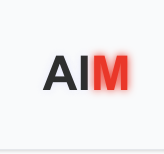

# AIm - AI Manager for DeFi Agents



## Project Overview

AIm is an AI manager that automatically creates and manages DeFi agents, optimizing their interaction with decentralized finance. As part of the development, a smart contract was deployed on the Sonic Blaze testnet, and the Zerepy framework was configured and launched.

Zerepy is deployed as a server, and we use its endpoints to access the server, which allows connecting various plugins and executing any tasks in the blockchain network.

## Key Features

### 1. Automatic Creation of DeFi Agents
- AIm allows users to quickly deploy custom AI agents for various DeFi scenarios (liquidity, lending, arbitrage, hedging)
- Use of Zerepy API for flexible configuration of agent parameters and their interaction with markets

### 2. Cross-Chain Interactivity with deBridge
- deBridge connection allows AI agents to interact with assets and data across multiple blockchains
- Flexibility in choosing the best DeFi products through cross-chain transactions
- Automation of bridges for transferring liquidity between different ecosystems

### 3. Self-learning AI through Allora
- AIm uses Allora Network for adaptive machine learning
- AI agents analyze data, make predictions, and adjust strategies in real-time
- Advanced protection mechanisms against market manipulations and bots

### 4. Integration with Sonic Blaze
- All AI agents operate through a smart contract in the Sonic Blaze testnet, ensuring security and transparency
- Use of Sonic's built-in functions for transaction automation and asset control

### 5. Autonomous Optimization of DeFi Operations
- AI agents independently analyze markets, make decisions, and execute strategies
- Minimization of manual management: the system suggests strategies based on market data

## Technical Capabilities

### 1. Smart Contract in Sonic Blaze
- Ensures security and transparency of all operations
- Used for automatic execution of AI agent strategies

### 2. Zerepy Framework
- Launched as a server, provides interaction with the blockchain
- Supports plugins that extend the functionality of DeFi agents
- Flexibility in configuring and launching new tasks via API

### 3. Integration with deBridge
- AI agents can interact with assets on different blockchains
- Support for automated bridges for moving liquidity

### 4. Using Allora for Self-learning AI
- AI agents adapt to changing market conditions
- Strategy optimization based on machine learning

## Zerepy Plugins and Their Functionality

Zerepy supports a system of modular plugins, allowing AI agents to be adapted for various tasks:

### 🔹 Liquidity Manager
- Automatic liquidity management
- Determination of the optimal liquidity pool
- Automatic transfer of funds to increase yield
- Integration with deBridge for cross-chain operations

### 🔹 Risk Analyzer
- Analysis of DeFi strategy risks
- Assessment of asset volatility and APY changes
- Calculation of credit risk when using lending platforms
- Monitoring of smart contract security parameters

### 🔹 Yield Optimizer
- Automatic yield optimization
- Connection to the pool with maximum APR
- Implementation of complex reinvestment strategies
- Use of AI models based on Allora for dynamic adaptation

### 🔹 Transaction Bundler
- Grouping and optimization of transactions
- Reduction of gas costs by combining operations
- Intelligent transaction routing

### 🔹 On-Chain Data Aggregator
- Collection and processing of data
- Collection of data on prices, liquidity, and user activity
- Analysis of market trends for decision-making by AI agents
- Support for API integrations with external data sources

## Why AIm Uses Allora and deBridge

- ✅ Allora makes AI agents self-learning, increasing their accuracy and efficiency
- ✅ deBridge opens up the possibility of working with liquidity on multiple blockchains without manual intervention
- ✅ The combination of Allora + deBridge + Zerepy forms an autonomous ecosystem of DeFi agents
- This gives AIm a unique advantage in the market of automated DeFi solutions

## Current Project Status

- ✅ Smart contract deployed in the Sonic Blaze testnet
- ✅ Zerepy framework configured and launched as a server
- ✅ Zerepy endpoints integrated for flexible configuration of DeFi agents
- ✅ deBridge and Allora connected

## Project Architecture

- **Frontend**: Next.js (agent management interface)
- **Backend**: Node.js + Express (interactive APIs and data processing)
- **AI Module**: Python (model training through Allora)
- **Blockchain Integration**: Sonic Blaze (main infrastructure), deBridge (cross-chain), Allora (AI analytics)

## Project Structure

```
aim/
├── client/                 # Frontend application
│   ├── public/             # Static assets
│   ├── src/                # Source code
│   │   ├── app/            # Next.js app directory
│   │   │   ├── api-test/   # API testing page
│   │   │   ├── agent/      # Agent management
│   │   │   ├── createagent/# Agent creation
│   │   ├── components/     # React components
│   │   │   ├── layout/     # Layout components
│   │   │   ├── ui/         # UI components
│   │   ├── hooks/          # Custom React hooks
│   │   ├── lib/            # Utilities and API clients
│   │   │   ├── api/        # API integration
│   ├── package.json        # Dependencies and scripts
├── hardhat/                # Smart contract development
│   ├── contracts/          # Solidity contracts
│   ├── scripts/            # Deployment scripts
├── zerepy/                 # Zerepy framework integration
│   ├── plugins/            # Custom plugins
│   ├── server/             # Server configuration
```

## Project Values

- **Accessibility** – Creation of DeFi agents without deep technical knowledge
- **Flexibility** – Customization of strategies and business logic
- **Transparency** – Recording of all actions on the blockchain
- **Security** – Automatic audit before deployment

## Sonic Actions

AIm integrates with Sonic Blaze through the following actions:

- get-token-by-ticker
- get-sonic-balance
- send-sonic
- send-sonic-token
- swap-sonic

## Hackathon Compliance

The project meets the requirements of the Sonic DeFAI hackathon, as it:

- ✅ Uses Sonic – Deployment of AI agents in the Sonic Blaze ecosystem
- ✅ Combines AI + DeFi – AIm uses AI for automatic agent management
- ✅ Supports Cross-chain – Integration of deBridge for working with different blockchains
- ✅ Implements Machine Learning – Integration of Allora for adaptive DeFi strategies
- ✅ Simplifies DeFi – Allows users without technical knowledge to manage AI agents
- ✅ Demonstrates Innovation – This is a new level of AI automation in Web3
- ✅ Leverages AI – The main AI creates other AIs, fitting into the concept of AGI (Artificial General Intelligence)
- ✅ Has potential for scaling in the DeFi industry

## Getting Started

### Prerequisites

- Node.js (v16+)
- npm or yarn
- Access to Sonic Blaze testnet

### Installation

1. Clone the repository:
```bash
git clone https://github.com/yourusername/aim.git
cd aim
```

2. Install dependencies for the client:
```bash
cd client
npm install
```

3. Set up environment variables:
Create a `.env` file in the client directory with the following variables:
```
NEXT_PUBLIC_ZEREPY_API_URL=your_zerepy_api_url
NEXT_PUBLIC_SONIC_RPC_URL=your_sonic_rpc_url
```

4. Start the development server:
```bash
npm run dev
```

5. Access the application at `http://localhost:3000`

## Contributing

Contributions are welcome! Please feel free to submit a Pull Request.

## License

This project is licensed under the MIT License - see the LICENSE file for details.
